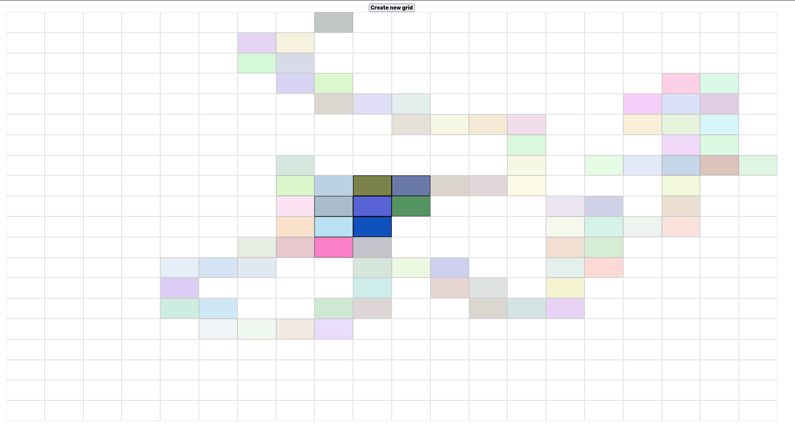

# Etch-a-Sketch

This project purpose is to practice about Document object model manipulation skill and Event handler and also with flexbox

A project to create a interactive website to create a square grid and interactive hover with each box
will color the box randomize!
</img>

User can choose grid size with button "Create new grid"

